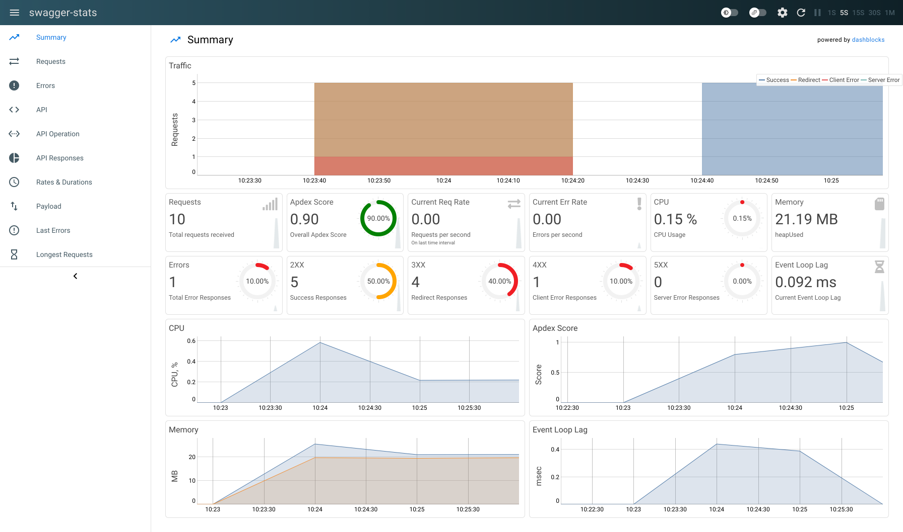

# Monitoring

Monitoring might not be of paramount importance when you are running unit tests or functional automation tests, but if you plan to use Camouflage for performance testing purposes, you would definitely need some monitoring in place. Thanks to `swagger-stats`, Camouflage provides you two options. You can use the inbuilt UI provided by swagger-stats by navigating to http://localhost:8080/monitoring, which will lead you to following dashboard updating itself in real time



If you'd like to store this data in Prometheus and then use Grafana to generate your own visualizations, Camouflage also provides you with a prometheus scraping endpoint available at `/monitoring/metrics` which contains information about your host and your mocks. You can install a Prometheus DB and configure it to scrape from `/monitoring/metrics` endpoint, and use that data to create charts for monitoring your application.

Sample Prometheus yml

```
global:
  scrape_interval:     15s
  evaluation_interval: 15s
scrape_configs:
  - job_name: 'camouflage'
    metrics_path: '/monitoring/metrics'
    static_configs:
    - targets: ['localhost:8080']
```

!!!note

        Update the target with your IP and port if running remotely or if you have specified a different port while starting Camouflage

