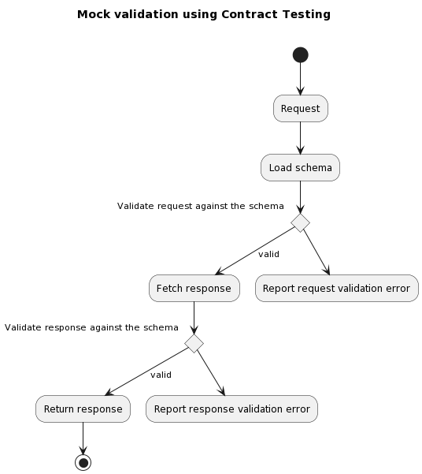

When testing software using a mock server it's important that your mocks are correct/valid to avoid false assumptions.

Contract testing is a grest methodology for ensuring that two separate systems are compatible and can communicate with one other.​

What sets this form of testing apart from other approaches that aim to achieve the same thing, is that each system can be tested independently from the other and that the contract is generated by the code itself, meaning the contract is always kept up to date with reality.​



## OpenApi schema validation

Camouflage server support OpenApi schema's for request and response validation. When enabled the configured schema's are loaded in memory and each request and response simply need to adhere to the rules in schema.

### Configuration Options

By default, validation is disabled. To specify any of these optional configurations, modify config.yml in following way.

```yaml
validation:
  enable: true
  schemas:
    - type: OpenApi
      url: https://raw.githubusercontent.com/OAI/OpenAPI-Specification/main/examples/v3.0/petstore.json
```

### Example

Now when you have a mock for the supported endpoint `/pets` requesting it would result in a proper response.

```javascript
HTTP/1.1 200 OK
Content-Type: application/json

[
  { "id": 1, "name": "Rabbit" },
  { "id": 2, "name": "Dog" },
  { "id": 3, "name": "Cat" },
  { "id": 4, "name": "Bird" }
]
```

#### Request validation

Given this schema for `/pets` we see that the only support parameter is the integer `limit`

```json
{
  "openapi": "3.0.0",
  "paths": {
    "/pets": {
      "get": {
        "summary": "List all pets",
        "operationId": "listPets",
        "parameters": [
          {
            "name": "limit",
            "in": "query",
            "description": "How many items to return at one time (max 100)",
            "required": false,
            "schema": {
              "type": "integer",
              "format": "int32"
            }
          }
        ]
        ...
    }
  }
}
```

Called with an unsupported paraemeter like `/pets?unsupported=1` will result in the following 400 error.

```json
[
  {
    "path": "page",
    "errorCode": "type.openapi.requestValidation",
    "message": "unknown query parameter 'unsupported'",
    "location": "query"
  }
]
```

Called with a wrong type like `/pets?limit=abc` will also result in the following 400 error.

```json
[
  {
    "path": "limit",
    "errorCode": "type.openapi.requestValidation",
    "message": "must be integer",
    "location": "query"
  }
]
```

#### Response validation

Given this schema for `/pets` we see that a pet has two required properties `id` and `name`.

```json
{
  "openapi": "3.0.0",
  "paths": {
    "/pets": {
      "get": {
        "summary": "List all pets",
        "operationId": "listPets",
        ...
        "responses": {
          "200": {
            "description": "A paged array of pets",
            "content": {
              "application/json": {
                "schema": {
                  "$ref": "#/components/schemas/Pets"
                }
              }
            }
          },
        ...
    }
  }
"components": {
    "schemas": {
      "Pet": {
        "type": "object",
        "required": [
          "id",
          "name"
        ],
        "properties": {
          "id": {
            "type": "integer",
            "format": "int64"
          },
          "name": {
            "type": "string"
          },
          "tag": {
            "type": "string"
          }
        }
      },
      "Pets": {
        "type": "array",
        "items": {
          "$ref": "#/components/schemas/Pet"
        }
      },
    ...
    }
  }
}
```

In case previously your backend api did only had a required property `id` your assumptions in the tests are false.

```javascript
HTTP/1.1 200 OK
Content-Type: application/json

[
  { "id": 1, "name": "Rabbit" },
  { "id": 2, "name": "Dog" },
  { "id": 3, "name": "Cat" },
  { "id": 4 }
]
```

Responses with the following mock will be blocked with a 409 response helping you to avoid mistakes.

```json
[
  {
    "path": "3",
    "errorCode": "required.openapi.responseValidation",
    "message": "must have required property 'name'"
  }
]
```
